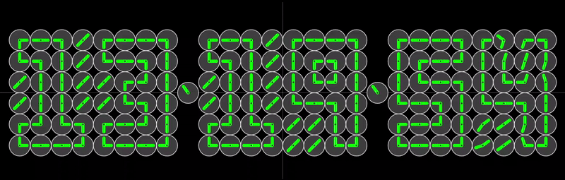
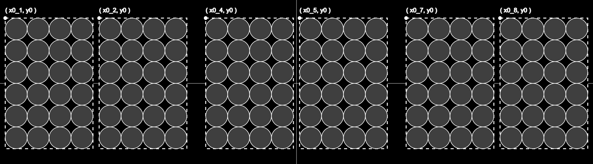
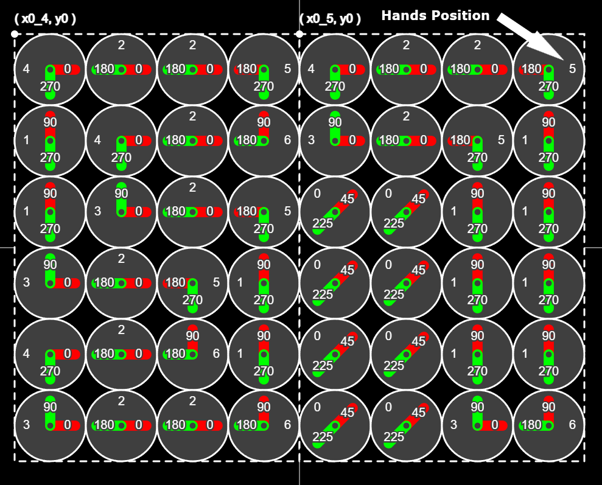
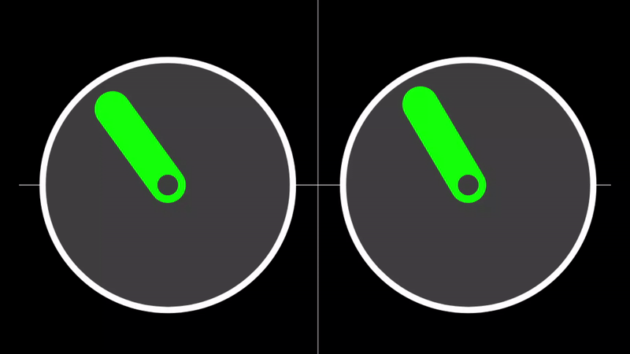

# Array Of Clocks

## [LINK TO DEMO ...](https://geniosainz.github.io/Array-Of-Clocks/)
 
Playing with JavaScript and [p5.js](https://p5js.org/) ... This clock is composed of 6 digits each with 6x4 clocks, making a total of 144. The clock is connected to the local time via the JavaScript API [Date](https://developer.mozilla.org/en-US/docs/Web/JavaScript/Reference/Global_Objects/Date) and uses the [p5gui](https://github.com/bitcraftlab/p5.gui) library, which generates a fast graphical user interface (sliders, colour picker, etc.) for each of your variables.




The application is optimised to work on screens with Width > Height. If Height > Width (phones typically in vertical mode) the application will create an alert telling the user to put the device in landscape mode. The arrays that make up the digits are centered on the screen with respect to their reference system, which is the upper left corner of each digit's bounding box *= (x0_i, y0)*.





# Clock Sequences

The clock animation is executed 20 times per second (frameRate) by the draw() function. The variable *frameCount* stores the number of frames that have been displayed since the program was started and is used to generate a sequence within each cycle between second i and second i+1. The secuence is:

- *Second i :* 1, 2, 3, ... frameRate-1, 0.
- *Second i+1:* 1, 2, 3, ... frameRate-1, 0.

For each frame this sequence is stored in the variable *remCicle* and computed as the remainder of *frameCount%frameRate.* Thanks to the remCycle sequence between different seconds, various functionalities can be attributed within the duration of each cycle. Such as calculate the angles only once (with efficiency in mind) and animate the clock hands allowing to modify their speed through the *stopFrames* variable. This variable stores the number of frames the clock hands remain stopped. When stopFrames is high, the speed of the hands is high too, as they have to sweep the same angle in less time. Therefore, for each animation cycle the following steps must be executed:

```js

if(remCycle == 1){

  // - Update dates:
  //    New secons, minutes and hours

  // - Compute angles:
  //    Compute angles beetwen hand initial position (hand_i) and hand end
  //    Position (hand_e).
  //    Compute delta angle = (+- angle between hand_i and hand_e) / nFrames

  // - Display initial position of the hands clock
}

else if( remCycle > 1 && (remCycle <= frameRate-stopFrames) ){

  // - Animation of the clock hands:
  //    From angle_i to angle_e throught transition positions
  //    angle_e = angle_i + delta1 * (remCycle-1)
}

else{
    
  // - Display end position of the hands clock.
}

```

This example shows how the angles change as a function of the frameCount for a frameRate value of 10 and stopFrames value of 4 for two consecutive seconds.
```js

frameRate  =  10 frames/s;
stopFrames =  4;
sec        =  second; 
angle_i    =  initial angle;
angle_e    =  end angle;
angle_i2e  =  angles between angle_i and angle_e;
delta      =  delta angle;
--------------------------------------------------
sec       =  i; 
angle_i   =  0;
angle_e   = 30;
angle_i2e = 30;
delta     =  5; 

frameCount: 1  remCicle:1  angle: 0.00  calcAngles
frameCount: 2  remCicle:2  angle: 5.00  animation
frameCount: 3  remCicle:3  angle:10.00  animation
frameCount: 4  remCicle:4  angle:15.00  animation
frameCount: 5  remCicle:5  angle:20.00  animation
frameCount: 6  remCicle:6  angle:25.00  animation
frameCount: 7  remCicle:7  angle:30.00  stopFrames
frameCount: 8  remCicle:8  angle:30.00  stopFrames
frameCount: 9  remCicle:9  angle:30.00  stopFrames
frameCount:10  remCicle:0  angle:30.00  stopFrames
--------------------------------------------------
sec       = i+1;
angle_i   =  30;
angle_e   = -60;
angle_i2e = -90;
delta     = -15; 

FrameCount:11  remCicle:1  angle: 30.00  calcAngles
FrameCount:12  remCicle:2  angle: 15.00  animation
FrameCount:13  remCicle:3  angle:  0.00  animation
FrameCount:14  remCicle:4  angle:-15.00  animation
FrameCount:15  remCicle:5  angle:-30.00  animation
FrameCount:16  remCicle:6  angle:-45.00  animation
FrameCount:17  remCicle:7  angle:-60.00  stopFrames
FrameCount:18  remCicle:8  angle:-60.00  stopFrames
FrameCount:19  remCicle:9  angle:-60.00  stopFrames
FrameCount:20  remCicle:0  angle:-60.00  stopFrames
---------------------------------------------------
```


# Digits Representation

The representation of each digit is determined by the position of the hands of each of the 24 clocks that make up the digit. All possible positions are stored in the beta array.

```js
// Handsº   [Hand1, Hand2]   // Hands Positions
let beta = [[45   , 225  ],  // 0  
            [90   , 270  ],  // 1
            [0    , 180  ],  // 2
            [0    , 90   ],  // 3
            [0    , 270  ],  // 4
            [180  , 270  ],  // 5
            [90   , 181  ]]; // 6
```


&nbsp;

For each digit these positions are stored as an array *ni*. The array *N* stores all digits:

```js
...

// digit 5
let n5 = [4, 2, 2, 5,
          1, 4, 2, 6,
          1, 3, 2, 5,
          3, 2, 5, 1,
          4, 2, 6, 1,
          3, 2, 2, 6];

// digit 7
let n7 = [4, 2, 2, 5,
          3, 2, 5, 1,
          0, 0, 1, 1,
          0, 0, 1, 1,
          0, 0, 1, 1,
          0, 0, 3, 6];
...

// array of digits      
let N  = [n0, n1, n2, n3, n4, n5, n6, n7, n8, n9];
```

The following simplified code represents the calculation process of a single digit. It returns the data object which contains the required variables for digit animation.

```js

let data   = [];    // object of arrays 
let mat_i  = N[ni]; // initial number
let mat_e  = N[ne]; // end number
let indx   = 0;     // each clock from 0 to nRows*ncols

for (let i = 0; i <= nRows-1; i++) {
  for (let j = 0; j <= nCols-1; j++) {

      // initial angles
      // angle_initial for hand 1 and clock(indx) = beta[ mat_i[indx] ][0]
      // angle_initial for hand 2 and clock(indx) = beta[ mat_i[indx] ][1]
      let hand1_i = beta[ mat_i[indx] ][0];
      let hand2_i = beta[ mat_i[indx] ][1];
      
      // end angles 
      // angle_end for hand 1 and clock(indx) = beta[ mat_e[indx] ][0]
      // angle_end for hand 2 and clock(indx) = beta[ mat_e[indx] ][1]
      let hand1_e = beta[ mat_e[indx] ][0];
      let hand2_e = beta[ mat_e[indx] ][1];
      
      // delta angles =  (angle between angle_initial and angle_end) / nFrames
      // The function angleT12 computes the signed angle (positive counterclockwise) 
      // between angle_initial and angle_end
      let hand1_delta =  angleT12(hand1_i,hand1_e) / ( nFrames );
      let hand2_delta =  angleT12(hand2_i,hand2_e) / ( nFrames );
      
      // add the variables of clock index to the data object to animate it in the main function draw()
      data.push({hand1_i,hand1_e,hand1_delta,     // hand 1 variables
                 hand2_i,hand2_e,hand2_delta,     // hand 2 variables
                 handsPosition_i,handsPosition_e, // hands inital and end positions
                 xc,yc                            // coordinate center of the clock indx
                 });

      // go to the next clock
      indx += 1;
      
  };
};
```

# User Interface

The color, diameter and speed controls of the watch are self-explanatory. The second hand slider (for cloks between digits) sets whether the movement of the hands is smooth or sequential between consecutive seconds angle. This slider is used to control the variable  *secSmooth*.

- Theta 1 is the instantaneous angle of the **left clock** obtained by starting from 12:00 at 90° and using seconds as the cycle counter. Therefore, the value of theta1 will not change until the new second.

- Theta 2 is the instantaneous angle of the **right clock** obtained by starting from 12:00 at 90° and using seconds and milliseconds as the cycle counters between consecutive seconds. Therefore, the value of theta2 will change frameRate times per second (20 times) resulting in a smooth movement of the clock hands.

- Theta 3 can be equal to theta1 or theta2 depending on the value of secSmooth (the second hand slider variable). If *secSmooth = 1* the movement of the hands will be smooth. If *secSmooth = 0* the movement will be sequential.

```js
let alpha  = 360/60;
let theta1 = 90 - alpha*date.getSeconds();
let theta2 = 90 - alpha*(date.getSeconds() - date.getMilliseconds()/1000);
let theta3 = 90 - alpha*(date.getSeconds() - secSmooth*date.getMilliseconds()/1000);

// examples secs to angle
//  0 secs => 90-6*0   =  90º
// 15 secs => 90-6*15  =   0º
// 30 secs => 90-6*30  = 270º
// 45 secs => 90-6*45  = 180º
```

